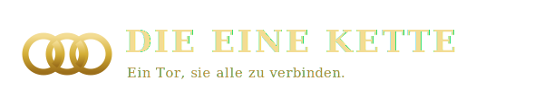

  

  <a href="./README.md">Deutsch</a> ·
  <a href="./README.en.md">English</a> ·
  <b>Français</b> ·
  <a href="./README.es.md">Español</a> ·
  <a href="./README.it.md">Italiano</a> ·
  <a href="./README.sr.md">Српски</a> ·
  <a href="./README.zh.md">中文</a>

# ⛓️ Die Eine Kette (DieEineKette)

> **Une porte pour les relier tous.**
> Une passerelle LLM multi-locataire (B2B), entièrement multilingue, avec contrôle des
> coûts sur les jetons *achetés* et *auto-hébergés*, et une interface moderne.

Die Eine Kette regroupe un nombre illimité de fournisseurs LLM (OpenAI, Anthropic,
Gemini, Azure, AWS Bedrock, Ollama, DeepSeek, Mistral, modèles locaux …) derrière **une**
seule interface `/v1` compatible OpenAI, avec une couche de gestion B2B par-dessus
(entreprises, départements, utilisateurs, budgets).

> 🚧 Phase de fondation — voir [`docs/`](./docs). Démarrage : `docker compose up`.

---

## 🙏 Origine & licence

Die Eine Kette est basé sur **[One API](https://github.com/songquanpeng/one-api)** de
JustSong (licence MIT) — notamment son moteur de relais éprouvé avec ~45 intégrations de
fournisseurs. Merci au projet One API. Le texte original de la licence MIT est conservé
dans [`backend/LICENSE`](./backend/LICENSE).

**Double licence pour le code propre de Die Eine Kette** : **gratuit pour un usage privé,
étudiant, académique et non commercial** — **l'usage commercial nécessite une licence
payante**. Voir [docs/licensing.md](./docs/licensing.md).
