# 🗺️ Roadmap

> Richtungsweisend nach **Modulen & Status** — **bewusst ohne Datumsangaben**.
> Reihenfolge und Umfang können sich ändern; dies ist keine verbindliche Zusage.

```mermaid
flowchart LR
  classDef done fill:#1f6f43,stroke:#2ecc71,color:#ffffff;
  classDef wip  fill:#7a5b16,stroke:#f1c40f,color:#ffffff;
  classDef plan fill:#2c3e50,stroke:#95a5a6,color:#ffffff;

  subgraph DONE["✅ Verfügbar"]
    d1["Multi-Provider-Gateway<br/>(OpenAI-kompatibel)"]
    d2["Eigenes UI · 12 Sprachen"]
    d3["Tokens mit Limit & Ablauf"]
    d4["2FA / TOTP"]
    d5["Organisationen (Mandanten)"]
    d6["Budgets · Limit · Burndown"]
    d7["Kosten-Dashboard · CSV-Export"]
    d8["Logs & Audit"]
  end

  subgraph WIP["🛠️ In Arbeit"]
    w1["Mandanten-Isolation & Rollen"]
    w2["Harte Budget-/Token-Sperre"]
    w3["Responsive Politur"]
    w4["Öffentliches Docker-Image"]
  end

  subgraph PLAN["🧭 Geplant"]
    p1["Smart-Routing<br/>(günstigstes/schnellstes Modell)"]
    p2["Observability & Metriken"]
    p3["SSO / SAML"]
    p4["Hochverfügbarkeit / Failover"]
    p5["Webhooks & Alerts"]
    p6["Backups / Disaster-Recovery"]
  end

  DONE --> WIP --> PLAN

  class d1,d2,d3,d4,d5,d6,d7,d8 done;
  class w1,w2,w3,w4 wip;
  class p1,p2,p3,p4,p5,p6 plan;
```

## Legende

| Status | Bedeutung |
|---|---|
| ✅ **Verfügbar** | im aktuellen Stand nutzbar (Alpha-Qualität, kann Fehler enthalten) |
| 🛠️ **In Arbeit** | aktiv in Entwicklung |
| 🧭 **Geplant** | vorgesehen, noch nicht begonnen |

> Einige geplante Module sind kommerziellen Lizenzen vorbehalten — siehe
> [docs/licensing.md](./licensing.md).
